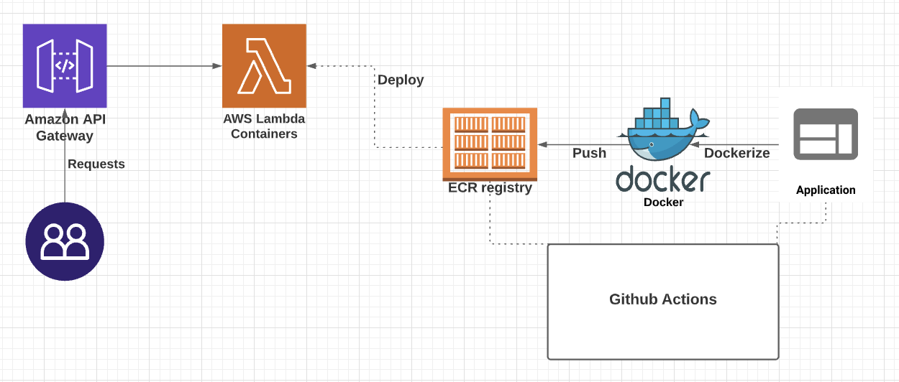
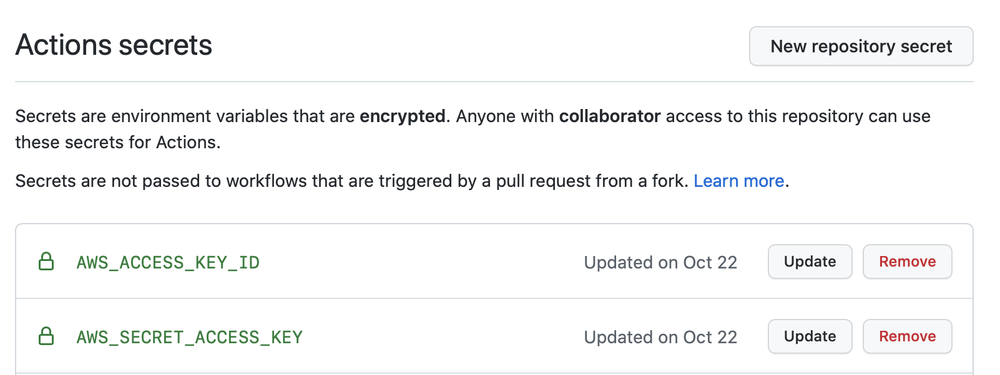
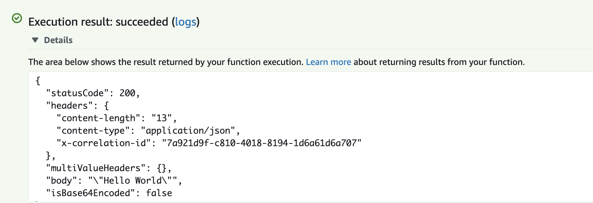

# Fastapi Lambda Container

Setting up a basic FastAPI application using Lambda Containers

## FrameWorks and AWS Services to be used:
* FastAPI
* AWS Lambda
* AWS Elastic Container Registry (ECR)
* AWS ApiGateWay
* Docker

## WorkFlow Diagram
<br>

<br>
<br

>
## Steps to be Followed:
<br>
FastAPI Application -> Dockerize -> Push to AWS ECR -> Deploy the latest image to the Lambda -> Attach an APIGateWay
<br><br>

Please Note:

* Create a Repository on AWS ECR first before pushing. (fastapilambdacontainer in this case)
* The feature.workflow.yml requires the following github secrets:
    * AWS Access Key ID
    * AWS Secret Access Key
    <br><br>
    
    <br>
<br>
* If you want to push the image to ECR using workflow, checkout deploy.sh file.
* Create a lambda function and select 'Container Image' from 'Choose one of the following options to create your function.' while creating the function.
* Once the image is successfully pushed to AWS ECR:
    * Go to the Lambda Function and select 'Image' from the navigation menu.
    * Click on 'Deplpy new image'.
    * Browse for the latest image and click save once you have selected the right image.
    * Wait for couple of minutes for the image to be deployed.

<br>

## Testing the Lambda Container

* Go to the Test tab in the navigation menu in order to test the lambda container.
* Select 'apigateway-aws-proxy' for Template.
* Give the event a name.
* Make sure the following changes are made:
```
{
  "body": "eyJ0ZXN0IjoiYm9keSJ9",
  "resource": "/{proxy+}",
  "path": "/test", // Needs to be changed according to the application.
  "httpMethod": "GET", // Needs to be changed according to the application.
  "isBase64Encoded": true,
  "queryStringParameters": {
    "foo": "bar"
  },
    .....
    ....

    "path": "/test", // Needs to be changed according to the application.
    "resourcePath": "/{proxy+}",
    "httpMethod": "GET", // Needs to be changed according to the application.
    "apiId": "1234567890",
    "protocol": "HTTP/1.1"
  }
}
```

<br>

You will get the following response if you are testing the '/test' route:


<br>

* Attach an APIGateWay to the container. Make sure to use the{proxy} route.

* Blog for AWS Lambda Container: https://medium.com/analytics-vidhya/python-fastapi-and-aws-lambda-container-3e524c586f01

